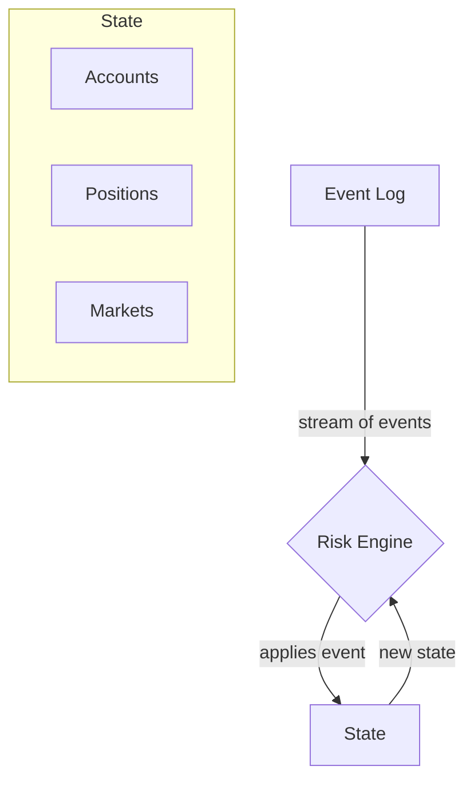

# Design Document: Deterministic Cross-Margin Risk Engine

**Author:** Alyazeed Basyoni
**Date:** 2026-03-01

## 1. Overview

This document outlines the architectural design for a deterministic, off-chain, cross-margin risk engine for a perpetuals exchange, as required by the take-home assignment. The system is designed to be minimal, robust, and verifiable, with a primary focus on correctness and deterministic replay.

The chosen implementation language is **Rust**. Its strong type system, memory safety guarantees without a garbage collector, and focus on performance make it an excellent choice for building a financial engine where precision, predictability, and resource control are paramount. Determinism is achieved through an event-sourcing architecture and the exclusive use of fixed-point arithmetic.

## 2. System Architecture

The engine is built on an **event-sourcing** pattern. The state of the entire system (all accounts, positions, and markets) is derived solely by applying a strictly ordered sequence of events from an event log. This design inherently guarantees determinism: given the same initial state and the same event log, the final state will always be identical.

### 2.1. Core Components

-   **Event Log:** An ordered, append-only list of all actions that can mutate the system state (e.g., `Deposit`, `Trade`, `MarkPriceUpdate`). This is the single source of truth.
-   **Engine:** The central processing unit. It consumes events one by one and applies them to the current state, producing a new state. It contains all the business logic for margin calculation, risk checks, and liquidation.
-   **State:** A snapshot of all accounts, collateral, positions, and market data at a specific point in time. It is entirely reconstructible from the event log.

### 2.2. Data Flow

The data flow is unidirectional and simple, ensuring predictability.



## 3. State Model

The state is modeled using a set of core data structures. All monetary and price values are represented using a fixed-point decimal type (`rust_decimal::Decimal`) to prevent floating-point inaccuracies and ensure determinism.

-   **`EngineState`**: The top-level container for the entire system state.
    -   `accounts`: A `BTreeMap` from `AccountId` to `Account`. `BTreeMap` is used over `HashMap` to guarantee deterministic iteration order.
    -   `markets`: A `BTreeMap` from `MarketId` to `MarketConfig`.

-   **`Account`**: Represents a single trader's portfolio.
    -   `collateral`: The amount of collateral (e.g., USDC) held by the user. This balance includes all realized PnL from closed positions or partial closes.
    -   `positions`: A `BTreeMap` from `MarketId` to `Position`, representing the user's holdings in each market.

-   **`Position`**: A user's position in a single market.
    -   `size`: The quantity of contracts. Positive for a long position, negative for a short.
    -   `entry_price`: The volume-weighted average price (VWAP) of the current open position.

-   **`MarketConfig`**: Represents a single perpetual market's parameters.
    -   `mark_price`: The current price of the underlying asset, used for all PnL and margin calculations.
    -   `im_fraction`: The Initial Margin fraction (e.g., 5%).
    -   `mm_fraction`: The Maintenance Margin fraction (e.g., 2%).

-   **`Event`**: An enum representing all possible state mutations.
    -   `CreateMarket { ... }`
    -   `Deposit { ... }`
    -   `Withdrawal { ... }`
    -   `Trade { ... }`
    -   `MarkPriceUpdate { ... }`
    -   `FundingPayment { ... }`

## 4. Core Logic & Computations

All risk is calculated at the portfolio level, allowing positions to collateralize each other.

### 4.1. Portfolio Equity and Margin

-   **Unrealized PnL**: For each position, `PnL = size * (current_mark_price - entry_price)`. The total Unrealized PnL is the sum across all of an account's positions.
-   **Total Position Value**: The sum of `position.size * market.mark_price` for all positions in an account.
-   **Portfolio Equity**: `account.collateral + Total Unrealized PnL`.
-   **Total Notional Value**: The sum of `abs(position.size * market.mark_price)` for all positions.
-   **Maintenance Margin (MM) Requirement**: `Total Notional Value * mm_fraction`.
-   **Initial Margin (IM) Requirement**: `Total Notional Value * im_fraction`.

### 4.2. Risk Checks for New Trades

To ensure the system remains solvent, a risk check is performed before executing any new trade. The trade is only permitted if the account will have sufficient collateral to meet the initial margin requirement *after* the trade.

1.  A temporary, post-trade `Account` state is created in memory.
2.  The `Portfolio Equity` and `Initial Margin Requirement` are calculated based on this hypothetical state.
3.  The trade is **allowed** if and only if `Post-Trade Portfolio Equity >= Post-Trade Initial Margin Requirement`.

### 4.3. Liquidation Logic

An account is flagged for liquidation if its equity falls below the maintenance margin requirement.

-   **Liquidation Trigger**: `Portfolio Equity < Maintenance Margin Requirement`.
-   **Process**: This check is performed after any event that can alter an account's risk profile (i.e., a `Trade` or `MarkPriceUpdate`).
-   **Simplified Execution**: As per the assignment, the liquidation process is simplified. All of the account's positions are closed at the current mark prices, and the realized PnL is added to the account's collateral. In a real system, this would involve a more complex process with liquidation engines, insurance funds, and fees.

## 5. Determinism Guarantee

Determinism is the most critical requirement of the system. It is guaranteed by:

1.  **Event-Sourced Architecture**: As described above, the state is a pure function of the event log. There are no side effects in the state transition logic.
2.  **Fixed-Point Arithmetic**: The `rust_decimal::Decimal` type is used for all calculations. This avoids the non-deterministic nature of floating-point numbers (IEEE 754) and ensures that calculations produce the exact same result every time, regardless of the underlying hardware.
3.  **Deterministic Iteration**: `BTreeMap` is used for all key-value stores (accounts, positions, markets). This ensures that operations that iterate over these maps (e.g., calculating total notional, checking for liquidations) do so in the same order every time, preventing any potential for divergence.
4.  **No External Dependencies**: The core risk engine logic has no I/O (network, disk, etc.) or other external dependencies that could introduce non-determinism.

## 6. How to Run

### 6.1. Build and Run

```bash
# Build the project
cargo build

# Run the demo simulation
cargo run

# Run the test suite
cargo test
```

### 6.2. Demo Scenarios

The `main` function executes a hardcoded event log that demonstrates the three required scenarios:

1.  **Liquidation**: Account 1 becomes liquidatable after adverse price movement.
2.  **Trade Rejection**: Account 2's second trade is rejected due to insufficient margin.
3.  **Replay Determinism**: The entire event log is processed twice, and the final state hashes are compared to ensure they are identical.

The output of the run will clearly print the sequence of events, the results of each action (including rejections and liquidations), and the final verification of determinism.

## 7. How AI Was Used

AI (Manus) was used as a development accelerator throughout this project. Specifically:

-   **Architecture & Design**: I outlined the high-level architecture (event-sourcing, fixed-point arithmetic, cross-margin model) and used AI to help flesh out the detailed state model and formalize the margin computation logic.
-   **Code Generation**: AI assisted with scaffolding the Rust implementation — the data structures, event processing loop, and margin calculations. I reviewed, refined, and tested the generated code to ensure correctness.
-   **Test Cases**: AI helped generate the initial test suite, which I extended and validated against hand-calculated expected values.
-   **Documentation**: AI drafted the README and this design document based on my architectural decisions, which I then reviewed and edited.

All architectural decisions, tradeoff reasoning, and the overall design direction are my own. AI served as a productivity tool to accelerate implementation within the time constraint.

## 8. Simplifications and Tradeoffs

To meet the time constraints of the assignment, several simplifications were made:

-   **No Funding Rates**: The model includes a `FundingPayment` event, but does not implement the logic to calculate funding rates. This would typically involve tracking a premium between the perpetual's mark price and the underlying's index price.
-   **Simplified Liquidation**: The liquidation process is not representative of a production system. It simply closes positions at the current mark price without simulating slippage, fees, or an insurance fund. A real system would have a more robust liquidation mechanism to handle underwater positions and manage systemic risk.
-   **Single Collateral Type**: The engine assumes a single asset (e.g., USDC) is used for collateral.
-   **No Order Book**: Trades are modeled as `Trade` events with a given size and price, abstracting away the order book and matching engine.
-   **Simplified State Hashing**: The deterministic state hash is a simple byte-level calculation for demo purposes. A production system would use a cryptographically secure hash like SHA-256.
